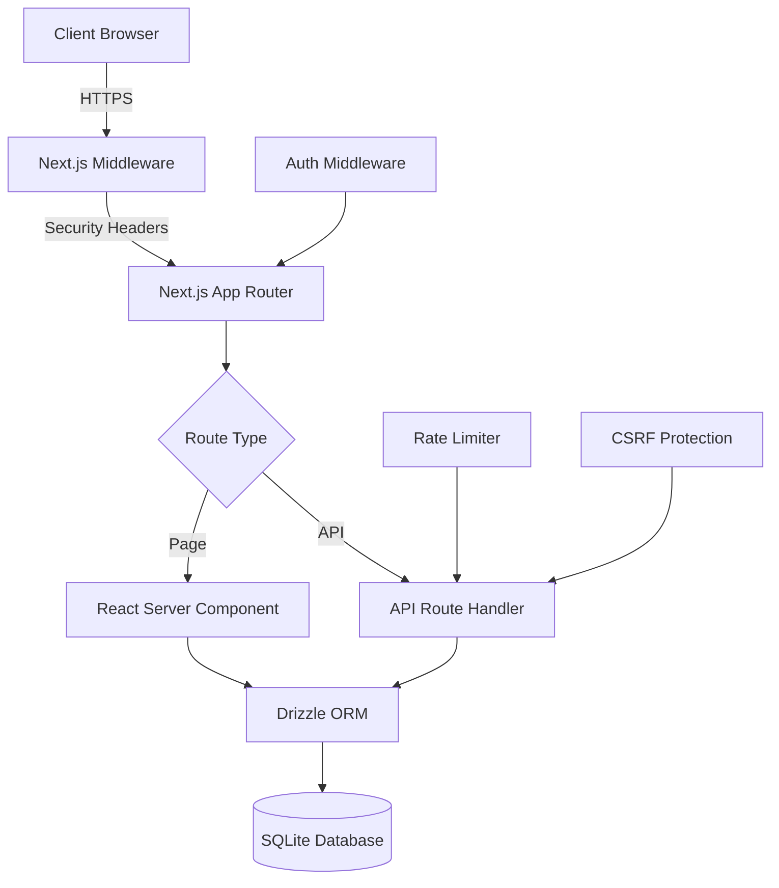

# Sekolahku Architecture

## Overview

Sekolahku is a comprehensive school management system built with Next.js 16, featuring multiple modules for student registration (SPMB), library management, savings (tabungan), attendance tracking, and more.

## Technology Stack

| Layer                | Technology                                       |
| -------------------- | ------------------------------------------------ |
| **Frontend**         | Next.js 16 (App Router), React 19, TailwindCSS 4 |
| **Backend**          | Next.js API Routes                               |
| **Database**         | SQLite (via better-sqlite3) with Drizzle ORM     |
| **Authentication**   | NextAuth v5 (Auth.js)                            |
| **Styling**          | TailwindCSS + Radix UI components                |
| **State Management** | SWR for server state, Zustand for client state   |
| **Error Tracking**   | Sentry                                           |
| **Testing**          | Vitest (unit), Playwright (E2E)                  |

## Directory Structure

```
sekolahku/
├── app/                    # Next.js App Router
│   ├── (auth)/            # Authentication pages (login, register)
│   ├── (dashboard)/       # Protected admin/staff pages
│   ├── (public)/          # Public-facing pages
│   └── api/               # API routes
├── components/            # React components
│   ├── ui/               # Base UI components (Button, Card, etc.)
│   └── [feature]/        # Feature-specific components
├── db/                    # Database layer
│   ├── schema/           # Drizzle ORM schemas
│   └── index.ts          # Database connection
├── lib/                   # Utilities and business logic
│   ├── security.ts       # XSS prevention, input sanitization
│   ├── rate-limit.ts     # Server-side rate limiting
│   ├── csrf.ts           # CSRF protection
│   ├── circuit-breaker.ts # Resilience patterns
│   ├── metrics.ts        # Application metrics
│   ├── logger.ts         # Structured logging
│   ├── cache.ts          # In-memory caching
│   ├── errors.ts         # Custom error classes
│   └── audit.ts          # Audit logging
├── e2e/                   # End-to-end tests
├── scripts/               # Utility scripts
└── docs/                  # Documentation
```

## Data Flow



## Security Architecture

### Defense in Depth

1. **Transport Layer**: HTTPS with HSTS
2. **Middleware Layer**: Security headers (CSP, X-Frame-Options, etc.)
3. **Application Layer**:
   - Input sanitization (`lib/security.ts`)
   - Rate limiting (`lib/rate-limit.ts`)
   - CSRF protection (`lib/csrf.ts`)
4. **Authentication**: NextAuth with JWT tokens
5. **Authorization**: Role-based access control (RBAC)

### Security Headers

| Header                    | Purpose                         |
| ------------------------- | ------------------------------- |
| Content-Security-Policy   | Prevents XSS and data injection |
| X-Frame-Options           | Prevents clickjacking           |
| X-Content-Type-Options    | Prevents MIME sniffing          |
| Referrer-Policy           | Controls referrer information   |
| Permissions-Policy        | Restricts browser features      |
| Strict-Transport-Security | Enforces HTTPS                  |

## Observability

### Logging

- **Structured logging** via `lib/logger.ts`
- Log levels: debug, info, warn, error
- JSON format in production, colored console in development
- Module-specific loggers (libLog, spmbLog, etc.)

### Metrics

- **Application metrics** via `lib/metrics.ts`
- Prometheus-compatible format at `/api/metrics`
- Counters: HTTP requests, errors, cache hits/misses
- Histograms: Request duration, DB query time
- Gauges: Active users, pending registrations

### Health Checks

- Enhanced health endpoint at `/api/health`
- Checks: Database connectivity, memory usage, circuit breakers
- Returns 503 on critical failure for orchestrator integration

## Resilience Patterns

### Circuit Breaker

```typescript
import { withCircuitBreaker } from "@/lib/circuit-breaker";

const data = await withCircuitBreaker(
  "external-service",
  () => fetchFromExternalAPI(),
  { failureThreshold: 5, recoveryTimeout: 30000 },
);
```

### Rate Limiting

```typescript
import { withRateLimit, RateLimitPresets } from "@/lib/rate-limit";

export const POST = withRateLimit(async (req) => {
  /* handler */
}, RateLimitPresets.STRICT);
```

## Database Schema

### Core Tables

| Module        | Tables                                                        |
| ------------- | ------------------------------------------------------------- |
| **Auth**      | users, accounts, sessions, profiles                           |
| **SPMB**      | spmb_periods, spmb_registrants                                |
| **Library**   | library_items, library_members, library_loans, library_visits |
| **Tabungan**  | tabungan_accounts, tabungan_transactions                      |
| **Inventory** | inventory_items, inventory_transactions                       |
| **Students**  | students, classes                                             |
| **Gallery**   | galleries                                                     |

### Indexes

All frequently-queried columns have indexes defined in the schema files. Key indexes include:

- `idx_item_status` - Library item availability
- `idx_loan_member` - Loan lookups by member
- `idx_registrant_status` - SPMB status filtering

## API Conventions

### Response Format

```typescript
// Success
{ success: true, data: {...} }

// Error
{ success: false, error: { code: "ERROR_CODE", message: "Human readable" } }
```

### HTTP Status Codes

| Code | Usage            |
| ---- | ---------------- |
| 200  | Success          |
| 201  | Created          |
| 400  | Validation error |
| 401  | Unauthorized     |
| 403  | Forbidden        |
| 404  | Not found        |
| 429  | Rate limited     |
| 500  | Server error     |

## Deployment

### Docker

```bash
# Build
docker build -t sekolahku .

# Run
docker compose up -d
```

### Environment Variables

See `.env.example` for required variables:

- `AUTH_SECRET` - NextAuth secret key
- `DATABASE_URL` - Database connection (for future migration)
- `NEXT_PUBLIC_SENTRY_DSN` - Sentry error tracking

## Performance Optimizations

1. **Caching**: In-memory cache with TTL (`lib/cache.ts`)
2. **Database**: WAL mode enabled, indexes on common queries
3. **Frontend**: React Server Components, image optimization
4. **Bundle**: Package import optimization, standalone output

## Testing Strategy

### Unit Tests

```bash
npm test                  # Run all tests
npm run test:coverage     # With coverage report
```

### E2E Tests

```bash
npm run test:e2e          # Run Playwright tests
npm run test:e2e:ui       # Interactive mode
```

### Test Files

- `lib/*.test.ts` - Business logic tests
- `e2e/*.spec.ts` - End-to-end flows
